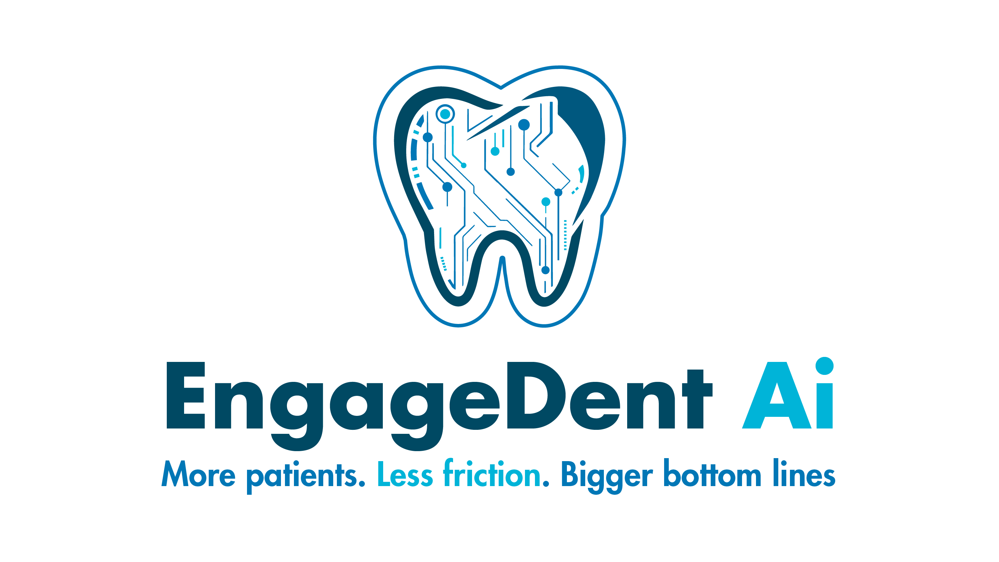
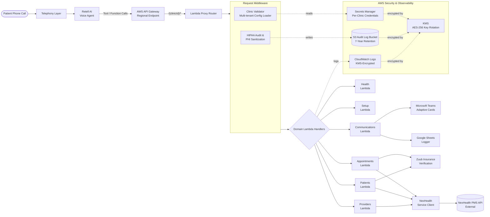

# Engage Dent



> A HIPAA-compliant, multi-tenant voice-AI backend that lets dental practices automate patient intake, appointment booking, and cancellations through a conversational phone agent — end-to-end, without a human receptionist.

[](https://www.typescriptlang.org/)
[](https://nodejs.org/)
[](https://aws.amazon.com/lambda/)
[](https://aws.amazon.com/api-gateway/)
[](https://www.terraform.io/)
[](https://www.hhs.gov/hipaa/index.html)
[](https://aws.amazon.com/kms/)
[](https://www.retellai.com/)
[](https://www.nexhealth.com/)

**Live Production:** [https://engagedent.com](https://engagedent.com)

---

## Overview

Dental practices lose a meaningful share of revenue to missed calls, voicemail, after-hours patients, and staff bandwidth spent triaging routine scheduling requests. Engage Dent replaces the front-desk phone queue with a conversational voice agent that is wired directly into the clinic's Practice Management System (PMS).

A patient calls a clinic's existing number and speaks naturally with an AI receptionist. Behind the scenes, the voice agent performs live PMS lookups, creates or identifies the patient, finds real availability across multiple operatories, books or cancels the appointment, and sends confirmations into the clinic's existing operational tooling — all in under a typical call duration.

The system is:

- **Multi-tenant** — a single deployment serves many independent dental clinics, each with its own PMS credentials, phone numbers, timezone, business hours, and scheduling rules.
- **HIPAA-compliant** — every request that touches Protected Health Information (PHI) is audited, sanitized, and encrypted at rest and in transit.
- **Serverless** — deployed as a fleet of AWS Lambda functions behind API Gateway, provisioned entirely through Terraform.
- **PMS-agnostic by design** — a configuration-driven scheduling engine abstracts over different PMS booking workflows (operatory-only, provider-centric, appointment-type-driven, and hybrid models).

---

## High-Level Architecture



### Request Lifecycle

1. A patient calls the clinic. Telephony routes the call to a clinic-specific Retell AI agent.
2. The agent reasons over the conversation and invokes tool calls against the Engage Dent API.
3. API Gateway proxies the request, extracting a path-based `clinicId` that identifies the tenant.
4. A clinic-validation middleware resolves tenant configuration and injects it into the request context.
5. A HIPAA middleware starts an audit record, detects PHI fields, and masks sensitive values in logs.
6. The domain handler performs business logic against NexHealth (the PMS), Teams, and Sheets.
7. A structured response is returned to Retell, which verbalizes the result back to the patient.

---

## Tech Stack & Tooling

### Backend / Runtime

- **Node.js 20** + **TypeScript** (`strict: true`) across the entire codebase
- **AWS Lambda** (6 domain-split functions) behind **Amazon API Gateway**
- **Express** for local development parity (`local-test-server.ts`)
- **Zod** for request schema validation
- **Helmet** + CORS hardening for local/dev HTTP surface

### AI / Voice

- **Retell AI** — conversational voice agent with function-calling against our REST API
- Custom tool schemas that translate natural-language intent into PMS operations (identify patient, search availability, book, cancel, reschedule)

### Integrations

- **NexHealth** — universal dental PMS API (primary system of record)
- **Zuub** — insurance eligibility / verification (270/271-style flow)
- **Microsoft Teams** — adaptive-card notifications for booking events
- **Google Sheets** — human-readable operational log for clinic staff

### Infrastructure & DevOps

- **Terraform** (HCL) — full IaC for Lambdas, API Gateway, IAM, KMS, S3, CloudWatch, Route 53
- **AWS Secrets Manager** + **SSM Parameter Store** — per-clinic credential isolation
- **AWS KMS** (AES-256, annual rotation) — encryption for logs, audit trail, secrets
- **AWS S3** — immutable HIPAA audit-log sink with lifecycle policies
- **CloudWatch** — KMS-encrypted Lambda logs and metrics
- **GitHub Actions** — CI pipeline for type-checking, linting, and Lambda packaging

### Quality & Compliance

- **ESLint** + **Prettier**, strict TS compiler
- **Jest** + **ts-jest** for unit and integration tests with mocked external APIs
- HIPAA audit middleware with PHI field detection, IP masking, and 7-year retention policy

---

## Core Technical Challenges & Solutions

The three sections below describe the most architecturally interesting problems the system solves. Code is intentionally generic and illustrative — not pulled from the production repo.

### 1. HIPAA-Compliant Voice-AI Data Flow

**Problem.** Voice agents are probabilistic systems that handle PHI (names, DOBs, phone numbers, appointment details) in real time. HIPAA requires that every access, modification, and transmission of PHI be auditable, sanitized in logs, and encrypted end-to-end — including through third-party AI infrastructure that you do not directly control.

**Approach.**

- **Request-scoped audit envelope.** Every Lambda invocation is wrapped in a middleware that instantiates a structured audit record at function entry and finalizes it on exit — capturing `requestId`, `clinicId`, endpoint, HTTP method, masked source IP, PHI fields accessed, PHI fields modified, response status, and response latency. Records are shipped to an immutable S3 bucket with a 7-year retention lifecycle and KMS-managed server-side encryption.
- **Automatic PHI detection & masking.** A sanitization layer classifies 15+ PHI field types (name, DOB, phone, email, SSN, insurance IDs, etc.) and transforms them before any log line is written. Names are partially masked (`Michael` → `Mi****el`), IPs are masked, and structured fields are redacted. Raw PHI never reaches CloudWatch.
- **Principle of least privilege per function.** Each of the 6 Lambda functions runs with an IAM role scoped to only the Secrets Manager entries, S3 prefixes, and KMS keys it needs. No wildcard resource permissions exist in the production policy set.
- **Encryption everywhere.** TLS 1.2+ enforced at API Gateway; KMS-encrypted CloudWatch log groups, S3 audit bucket, and Secrets Manager secrets; TLS for every outbound call to NexHealth, Teams, and Sheets.
- **PHI-safe error paths.** Error handlers scrub exception messages and stack traces before they are logged, preventing accidental PHI leakage via thrown errors from downstream APIs.

Illustrative shape of the audit envelope (generic, for reference only):

```typescript
interface AuditEnvelope {
  requestId: string;
  tenantId: string;
  endpoint: string;
  method: string;
  sourceIpMasked: string;
  phiAccessed: PhiFieldType[];
  phiModified: PhiFieldType[];
  responseStatus: number;
  responseTimeMs: number;
  encryptionApplied: true;
  sanitized: true;
}
```

The net effect: the AI can reason freely in the conversational layer, but every byte of PHI that crosses a system boundary is accounted for, masked, and encrypted.

---

### 2. Multi-Tenant, Config-Driven Scheduling Engine

**Problem.** No two dental practices book appointments the same way. Some book strictly by operatory (room), some book by provider, some by appointment type + duration, and many use hybrid rules (e.g., "hygiene can use any open room, but surgery must use operatory 3 with Dr. Patel"). Hardcoding this per clinic is not viable — onboarding a new clinic should be a configuration change, not a code change.

**Approach.**

- **Path-based tenant routing.** Every request is scoped by a `clinicId` URL segment (`/{clinicId}/<endpoint>`). A clinic-validator middleware loads that tenant's configuration at the edge of the request and injects it into downstream handlers. Tenants cannot see one another's data.
- **Declarative scheduling modes.** Each tenant config declares a `schedulingMode` — `operatory_only`, `provider_centric`, `appointment_type_driven`, or `hybrid` — along with its bookable operatories, providers, appointment types, priority weights, and business-hour windows.
- **A single booking algorithm, many behaviors.** The booking engine is written once. At runtime, it reads the tenant's scheduling mode and progressively narrows the search space:

  1. Validate requested time against tenant timezone + business hours (including a configurable minimum lead time for same-day bookings).
  2. Build a candidate set of (operatory, provider, appointment-type) triples that are legal under the tenant's mode.
  3. Score candidates using the tenant's priority configuration (e.g., prefer operatory 1, then 2; prefer the patient's usual provider).
  4. Check availability against the PMS and pick the highest-scoring slot that survives.

- **Zero-code onboarding.** Adding a new clinic is a matter of dropping in a JSON config with its NexHealth credentials, timezone, operatories, providers, and scheduling mode. The system auto-discovers appointment types and validates the config at load time.
- **Parallel availability checks.** For "any-operatory" voice flows, the engine fans out availability queries across operatories concurrently rather than iterating serially — critical for keeping the voice agent responsive under call-latency budgets.

Illustrative config shape (generic):

```typescript
interface TenantSchedulingConfig {
  schedulingMode: 'operatory_only' | 'provider_centric' | 'appointment_type_driven' | 'hybrid';
  timezone: string;
  businessHours: BusinessHours;
  minimumLeadTimeMinutes: number;
  bookableOperatories: Array<{ id: number; priority: number; enabled: boolean }>;
  providers?: Array<{ id: number; priority: number }>;
  appointmentTypes?: Array<{ id: number; durationMinutes: number }>;
}
```

This design is the difference between a one-clinic prototype and a platform: the same Lambda code runs every tenant, and the behavior is entirely data-driven.

---

### 3. Deterministic Booking on Top of a Non-Deterministic Voice Agent

**Problem.** LLM-driven voice agents are inconsistent about how they pass structured data. The same logical intent — "book this patient for Tuesday at 10 AM" — can arrive as a rich JSON payload, a flattened `args`-only object, a fragmented sequence of tool calls, or with partially-filled fields (e.g., a phone number in one call, a name in the next). The PMS, however, demands deterministic, fully-qualified requests.

**Approach.**

- **Payload normalization layer.** Every handler accepts multiple payload shapes — the Retell function-call envelope, the flattened `args`-only format, and a direct REST format used for testing — and normalizes them into a single internal command object before any business logic runs.
- **Graceful field fallbacks.** Phone numbers are resolved by a prioritized chain (explicit `phoneNumber` → Retell `from_number` → caller-ID header), so the agent can omit what it already knows without breaking the flow.
- **Patient identity resolution as a first-class step.** Before any booking happens, the system performs a deterministic identify-or-create flow: phone lookup → fallback to name + DOB → create as new patient. This isolates the one step the voice agent cannot afford to get wrong.
- **Timezone-correct validation.** All time inputs (which the agent may verbalize in the patient's local frame) are converted to the clinic's configured timezone before availability math runs, eliminating a class of off-by-an-hour bugs that are otherwise nearly invisible in production.
- **Idempotent, confirmable responses.** Every booking response returns a structured confirmation (appointment ID, operatory, provider, ISO time, clinic-local time) that the voice agent can verbalize verbatim, removing its need to re-interpret the result.

The result: the voice agent gets to be a voice agent, and the backend guarantees that what hits the PMS is always a clean, fully-qualified, timezone-correct request.

---

## Security & Infrastructure Highlights

- **HIPAA compliance posture.** KMS-backed AES-256 encryption at rest for all log groups, audit buckets, and secrets; TLS 1.2+ enforced in transit; per-request audit trail shipped to immutable S3 with 7-year retention; automatic PHI detection and masking in every log line.
- **Tenant isolation.** Per-clinic credentials in AWS Secrets Manager, loaded lazily per request; path-based routing prevents cross-tenant data access at the middleware layer.
- **Least-privilege IAM.** Each of the 6 domain Lambda functions has its own role, scoped to only the specific Secrets Manager entries, S3 prefixes, KMS keys, and CloudWatch log groups it requires. No wildcard resource permissions.
- **Infrastructure as Code.** The entire AWS footprint — Lambda functions, API Gateway, KMS keys, IAM roles, S3 buckets with lifecycle + encryption policies, CloudWatch log groups, custom domain, Route 53 records — is defined in Terraform and deployable per environment (`dev`, `staging`, `prod`) via workspaces.
- **Serverless cost profile.** Pay-per-invocation Lambda + API Gateway means idle clinics cost effectively nothing, and the platform scales horizontally with no infrastructure changes as new tenants are onboarded.
- **Latency-sensitive parallelism.** Multi-operatory availability checks are fanned out concurrently so the voice agent's tool call returns within a call-latency budget, keeping the conversation natural rather than "hold on while I check."
- **Observability by default.** Structured JSON logging with Winston, per-tenant correlation IDs, and CloudWatch metrics on every external API call (NexHealth, Teams, Sheets) for SLA and incident response.
- **Secret hygiene.** No secrets in source, in Terraform state beyond pointers, or in environment files committed to the repo. Local dev uses `.env.example` templates; production uses Secrets Manager exclusively.

---

## At a Glance

| Dimension | Detail |
|---|---|
| **Architecture** | Serverless, multi-tenant, config-driven |
| **Runtime** | Node.js 20 + TypeScript (strict) |
| **Deploy target** | AWS Lambda + API Gateway (Terraform-managed) |
| **Tenants** | Path-based routing with per-clinic config and secrets |
| **AI layer** | Retell AI voice agent with function calling |
| **PMS integration** | NexHealth (primary), Zuub (insurance) |
| **Ops integrations** | Microsoft Teams, Google Sheets |
| **Compliance** | HIPAA — KMS encryption, audit trail, PHI sanitization, 7-year retention |
| **Environments** | `dev`, `staging`, `prod` via Terraform workspaces |

---

_This README intentionally describes system design and architecture only. No proprietary source, business logic, credentials, or tenant-specific configuration is included._